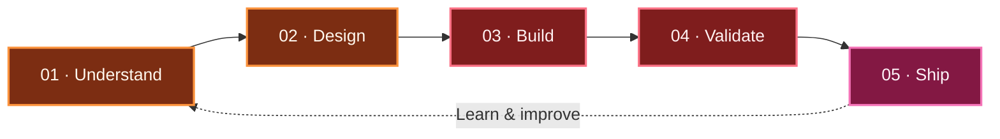

<!--
  GITHUB PROFILE README
  1. Keep profile.png in the root of your profile repository.
  2. Replace YOUR-LINKEDIN-USERNAME before publishing.
-->


<div align="center">


<br><br>


<br>

<i>I combine intelligent systems, reliable engineering, and thoughtful design to build products people can actually use.</i>

<br><br>

<a href="https://github.com/vigneshwar0246">
  
</a>
<a href="https://www.linkedin.com/in/YOUR-LINKEDIN-USERNAME">
  
</a>
<a href="https://github.com/vigneshwar0246/PORTFOLIO-3d">
  
</a>

<br><br>


<br>

<a href="#about-me">About</a>
&nbsp;•&nbsp;
<a href="#featured-projects">Projects</a>
&nbsp;•&nbsp;
<a href="#technology-stack">Technology</a>
&nbsp;•&nbsp;
<a href="#github-pulse">GitHub Pulse</a>
&nbsp;•&nbsp;
<a href="#lets-connect">Connect</a>

</div>

---

## About me

I'm **Vigneshwar Vicky**, an AI/ML engineer and full-stack developer focused on transforming ambitious ideas into practical, human-centered products.

My work lives at the intersection of **artificial intelligence, scalable APIs, data-driven systems, and engaging interfaces**. I enjoy owning the complete journey—from understanding a problem and experimenting with models to engineering the backend and delivering the final experience.

```yaml
developer:
  name: "Vigneshwar Vicky"
  role: "AI / ML Engineer"
  mission: "Build useful intelligence for real-world problems"

current_focus:
  - Generative AI
  - Machine Learning
  - Computer Vision
  - Natural Language Processing
  - AI-powered full-stack products
  - Digital twin systems

engineering_loop:
  "Understand → Design → Build → Measure → Improve"
```

<table>
<tr>
<td width="50%" valign="top">

### 🔥 Currently building

- Intelligent assistant experiences
- AI-powered health technology
- Predictive monitoring systems
- Full-stack machine learning products

</td>
<td width="50%" valign="top">

### 🧭 What drives me

- Solving meaningful problems
- Turning research into usable products
- Building clean, maintainable systems
- Learning through experimentation
- Improving every version I ship

</td>
</tr>
</table>

---

## How I build



> **My principle:** a strong product is not just an accurate model—it is an intelligent system that is reliable, understandable, and enjoyable to use.

---

## Featured projects

<table>
<tr>
<td width="50%" valign="top">

### 🤖 [HCL JARVIS](https://github.com/vigneshwar0246/HCL-JARVIS)

An AI assistant project exploring intelligent interaction, useful automation, and practical AI-driven experiences.

`AI Assistant` `Automation` `Python`

</td>
<td width="50%" valign="top">

### 🌐 [3D Developer Portfolio](https://github.com/vigneshwar0246/PORTFOLIO-3d)

An immersive portfolio experience combining modern web development, interactive interfaces, and 3D design.

`React` `Three.js` `Frontend`

</td>
</tr>

<tr>
<td width="50%" valign="top">

### 🩺 [Health Vault Chatbot](https://github.com/vigneshwar0246/health_vault_chatbotnew)

A conversational health-technology project designed to make health information more accessible and easier to navigate.

`Health Tech` `Chatbot` `AI`

</td>
<td width="50%" valign="top">

### ⚙️ [AI Digital Twin](https://github.com/vigneshwar0246/AI-Digital-Twin-for-Pneumatic-Cylinder-Health-Monitoring)

An AI-powered digital twin for monitoring pneumatic cylinder health and supporting predictive maintenance.

`Digital Twin` `Machine Learning` `Predictive Monitoring`

</td>
</tr>
</table>

<div align="center">

<a href="https://github.com/vigneshwar0246/HCL-JARVIS">
  
</a>
<a href="https://github.com/vigneshwar0246/PORTFOLIO-3d">
  
</a>

<a href="https://github.com/vigneshwar0246/health_vault_chatbotnew">
  
</a>
<a href="https://github.com/vigneshwar0246/AI-Digital-Twin-for-Pneumatic-Cylinder-Health-Monitoring">
  
</a>

</div>

---

## Technology stack

<div align="center">

### Languages


### Artificial intelligence and machine learning


### Web and API engineering


### Data, delivery and developer tools


</div>

<br>

<table>
<tr>
<td align="center"><b>Intelligence</b></td>
<td align="center"><b>Engineering</b></td>
<td align="center"><b>Experience</b></td>
<td align="center"><b>Delivery</b></td>
</tr>
<tr>
<td align="center">ML • DL • GenAI</td>
<td align="center">APIs • Data • Systems</td>
<td align="center">React • Next.js • 3D</td>
<td align="center">Git • Docker • GitHub</td>
</tr>
</table>

---

## GitHub pulse

<div align="center">


<br>


<br><br>


</div>

---

## Current signal

```text
╭──────────────────────────────────────────────────────────────╮
│  SYSTEM       ● ONLINE                                       │
│  FOCUS        Generative AI × Applied Machine Learning       │
│  BUILDING     JARVIS · Health Vault · Digital Twins          │
│  INTERFACE    Python · FastAPI · React · Next.js             │
│  MINDSET      Build → Measure → Learn → Improve → Repeat      │
╰──────────────────────────────────────────────────────────────╯
```

---

## Let's connect

<div align="center">

I'm always interested in conversations about **AI-powered products, machine learning, intelligent automation, health technology, and creative engineering**.

If you are building something meaningful, exploring an ambitious idea, or simply want to exchange knowledge, feel free to connect.

<br>

<a href="https://github.com/vigneshwar0246">
  
</a>
<a href="https://www.linkedin.com/in/YOUR-LINKEDIN-USERNAME">
  
</a>

<br><br>

### Building useful intelligence—one shipped idea at a time.

<sub>Thanks for visiting. Explore a project, start a conversation, or leave a ⭐ if something inspires you.</sub>

</div>


