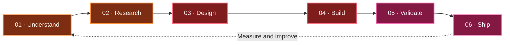

<!--
  VIGNESHWAR VICKY — GITHUB PROFILE README
  Keep profile.png in the root of your profile repository.
  Replace YOUR-LINKEDIN-USERNAME with your LinkedIn username.
-->


<div align="center">


<br><br>


<br>

### Building intelligence. Creating impact.

I develop AI-powered products by combining machine learning, reliable backend systems, and engaging user experiences.

<br>

<a href="https://github.com/vigneshwar0246">
  
</a>
<a href="https://www.linkedin.com/in/YOUR-LINKEDIN-USERNAME">
  
</a>
<a href="https://github.com/vigneshwar0246/PORTFOLIO-3d">
  
</a>

<br><br>


<br><br>

<a href="#about-me">About</a>
&nbsp;•&nbsp;
<a href="#systems-i-am-building">Current Systems</a>
&nbsp;•&nbsp;
<a href="#featured-projects">Projects</a>
&nbsp;•&nbsp;
<a href="#technology-stack">Technology</a>
&nbsp;•&nbsp;
<a href="#github-activity">Activity</a>

</div>

---

## About me

<table>
<tr>
<td width="58%" valign="top">

I'm **Vigneshwar Vicky**, an AI/ML engineer and full-stack developer who enjoys transforming complex ideas into practical, intelligent products.

My interests include artificial intelligence, machine learning, deep learning, generative AI, computer vision, natural language processing, digital twins, and modern web engineering.

I care about the entire product journey—from understanding the problem and experimenting with models to building APIs, designing the interface, testing the system, and shipping a complete experience.

</td>
<td width="42%" valign="top">

<pre>
SYSTEM      ● ONLINE
ROLE        AI / ML ENGINEER
MODE        BUILD + LEARN
FOCUS       APPLIED AI
INTERFACE   FULL STACK
STATUS      CREATING
</pre>

</td>
</tr>
</table>

```python
class VigneshwarVicky:
    role = "AI / ML Engineer"

    interests = [
        "Generative AI",
        "Machine Learning",
        "Computer Vision",
        "Natural Language Processing",
        "Full-Stack Development",
        "Digital Twin Systems",
    ]

    currently_building = [
        "JARVIS AI Assistant",
        "Health Vault",
        "AI Digital Twin",
        "Intelligent Applications",
    ]

    engineering_loop = "Build → Measure → Learn → Improve"
    mission = "Create intelligent systems that solve real problems"
```

---

## Systems I am building

<div align="center">

| System | Intelligence layer | Product layer | Mission |
|:--|:--|:--|:--|
| 🤖 **JARVIS AI** | Voice, vision, memory | Desktop automation | Build a capable personal AI assistant |
| 🏥 **Health Vault** | RAG, embeddings, analysis | Medical-report assistant | Make health information easier to understand |
| 🏭 **AI Digital Twin** | Prediction, monitoring | Industrial intelligence | Detect and understand equipment health |
| 🌐 **3D Portfolio** | Interactive experiences | Modern web interface | Present technical work creatively |

</div>

---

## Featured projects

<table>
<tr>
<td width="50%" valign="top">

<h3>🤖 J.A.R.V.I.S.</h3>

<b>Personal AI desktop assistant</b>

<p>
A local AI-powered assistant that combines voice interaction, vision, memory, computer control, file operations, notifications, and intelligent workflows.
</p>

<p>
<code>Voice AI</code>
<code>Vision</code>
<code>Memory</code>
<code>Automation</code>
</p>

<a href="https://github.com/vigneshwar0246/HCL-JARVIS">
  
</a>

</td>
<td width="50%" valign="top">

<h3>🏥 Health Vault</h3>

<b>AI medical-report assistant</b>

<p>
An intelligent health platform designed to analyze uploaded medical reports, perform semantic search, compare results, identify trends, and support conversational exploration.
</p>

<p>
<code>RAG</code>
<code>Embeddings</code>
<code>Semantic Search</code>
<code>AI Assistant</code>
</p>

<a href="https://github.com/vigneshwar0246/health_vault_chatbotnew">
  
</a>

</td>
</tr>

<tr>
<td width="50%" valign="top">

<h3>🏭 AI Digital Twin</h3>

<b>Pneumatic-cylinder health monitoring</b>

<p>
An AI-powered digital twin for monitoring pneumatic-cylinder health, analyzing operational data, and supporting predictive maintenance decisions.
</p>

<p>
<code>Machine Learning</code>
<code>Prediction</code>
<code>Monitoring</code>
<code>Digital Twin</code>
</p>

<a href="https://github.com/vigneshwar0246/AI-Digital-Twin-for-Pneumatic-Cylinder-Health-Monitoring">
  
</a>

</td>
<td width="50%" valign="top">

<h3>🌐 3D Developer Portfolio</h3>

<b>Interactive portfolio experience</b>

<p>
A modern developer portfolio that combines responsive web engineering, interactive interfaces, animations, and immersive 3D elements.
</p>

<p>
<code>React</code>
<code>Three.js</code>
<code>3D UI</code>
<code>Interactive Web</code>
</p>

<a href="https://github.com/vigneshwar0246/PORTFOLIO-3d">
  
</a>

</td>
</tr>
</table>

---

## My engineering workflow



<div align="center">

> A successful AI product is more than a model—it is a complete system that is reliable, understandable, and useful.

</div>

---

## Technology stack

<div align="center">

### Programming languages


<br><br>

### Artificial intelligence and machine learning


<br><br>

### Web and API engineering


<br><br>

### Databases and developer tools


</div>

<br>

<table>
<tr>
<td align="center" width="25%">

**Intelligence**

ML · DL · GenAI

</td>
<td align="center" width="25%">

**Engineering**

APIs · Data · Systems

</td>
<td align="center" width="25%">

**Experience**

React · Next.js · 3D

</td>
<td align="center" width="25%">

**Delivery**

Git · Docker · GitHub

</td>
</tr>
</table>

---

## GitHub activity

<div align="center">


<br><br>


<br><br>


</div>

---

## Developer terminal

```text
┌─────────────────────────────────────────────────────────────┐
│ vigneshwar@ai:~$ ./current-mission                          │
├─────────────────────────────────────────────────────────────┤
│                                                             │
│  STATUS       ONLINE                                        │
│  FOCUS        GENERATIVE AI × APPLIED MACHINE LEARNING      │
│  BUILDING     JARVIS · HEALTH VAULT · DIGITAL TWINS         │
│  TOOLKIT      PYTHON · FASTAPI · REACT · NEXT.JS            │
│  PRINCIPLE    USEFUL > COMPLEX                               │
│                                                             │
│  PROGRESS     ████████████████████████████████░░ LEARNING   │
│                                                             │
└─────────────────────────────────────────────────────────────┘
```

---

## Let's connect

<div align="center">

I'm interested in conversations about **AI-powered products, machine learning, intelligent automation, health technology, digital twins, and creative engineering**.

If you are building something meaningful or exploring an ambitious idea, let's connect.

<br>

<a href="https://github.com/vigneshwar0246">
  
</a>
<a href="https://www.linkedin.com/in/YOUR-LINKEDIN-USERNAME">
  
</a>

<br><br>


<br><br>

### Code. Create. Innovate.

<sub>Building useful intelligence—one shipped idea at a time.</sub>

<br><br>

⭐ Thanks for visiting my profile.

</div>


